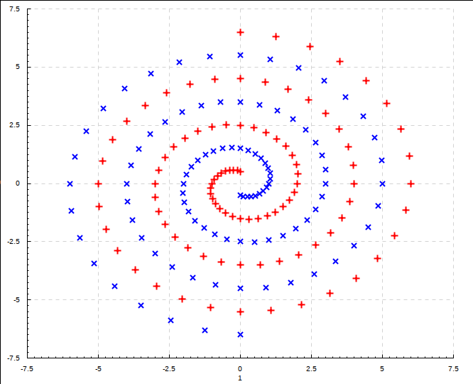
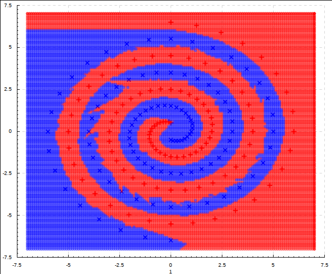

# Perceptron-based Binary Classification Networks

This library shows how binary classification of a data set can be achieved by combinding simple linear separators, able to classify the difference between a pair of points, by using unions or intersections of those simple classifiers. The classification network is constructed one pair at a time, adding new linear separators as necessary until the entire training data set is correctly classified.

It has been submitted as a Final Year Project in fulfilment of a degree of Bachelor of Sciences to the University of Bradford; the [accompanying report](https://raw.githubusercontent.com/dtorgunov/PerceptronClassifier/master/extra/report.pdf) is also made available as part of this repository.

A simple graphical user interface is provided, to show how the separating hyperplanes constructed actually partition the space that data fall within.

Most of the data included in this repository has been provided by the [UCI Machine Learning Repository](https://archive.ics.uci.edu/ml/index.php).

 
